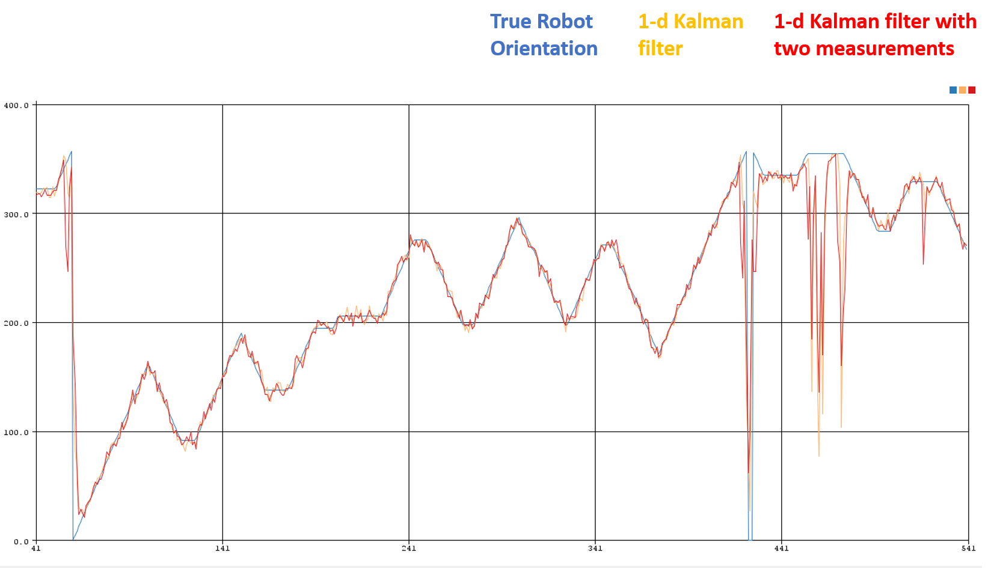

# Arduino 1-D Kalman Filter

## Contents

- Introduction
- Installation
- Guidance on use

## Introduction

This arduino script implements a 1-dimensional kalman filter.

This script uses the code formulation and principles explained in Roger Labbe's book: https://github.com/rlabbe/Kalman-and-Bayesian-Filters-in-Python

This script generates a 'Robot orientation' (state). A noisy process model (kinematics) and measurements from the state are input into the kalman filter.

The kalman filter is implemented using either 1 or 2 of the state measurements (i.e. using gyroscope and magnetometer)

## Installation

1. This code uses gausians and requires that Ivan Seidel's 'Gaussian' library is installed. Download it here: https://github.com/ivanseidel/Gaussian. Installation instructions are on the github page.

2. Run this script
   1. Download(zip) or clone this repository and extract to your computer. 
   2. Open with the arduino IDE
   3. Upload to arduino
   4. Open the arduino serial plotter to see the kalman filter in action

## Guidance on use

This code is checks how well a kalman filter performs in tracking the orientation of a robot using encoders, a gyroscope and a magnetometer.

This code performs the following functions

- [x] Creates 'simulated' robot orientation data
- [x] Takes noisy measurements from this data
- [x] Inputs measurement data to a kalman filter to track the robot orientation
- [x] Plots the kalman filter

To get started load the code onto the arduino, run it, then open the serial plotter. You will see something like the chart below, which shows the true robot orientation (simulated in blue), and the 1-d kalman filter tracking this. The red line plotting values returned from the kalman filter uses both the magnetometer **and** gyroscope in it's implementation.

